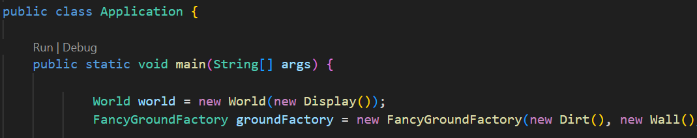

# mario-s1-2022

## Instructions to run game 

The link below shows how to install Visual Studio Code for Java and if you have already installed Visual Studio Code.

https://code.visualstudio.com/docs/languages/java#_install-visual-studio-code-for-java

After this, navigate to src/game/Application.java

Click run on top of the public static void main(String[] args) and the game will be shown in the terminal where you can input your desired option.

